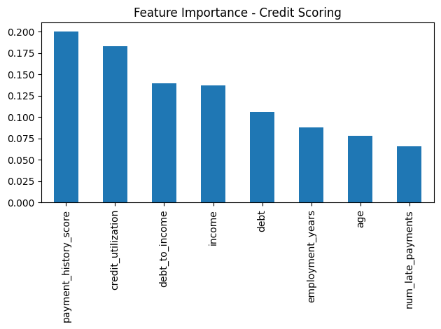

# Credit Scoring Model — CodeAlpha Machine Learning Internship

## Objective
Predict an individual's creditworthiness (good credit vs. default risk) using
financial history features, and compare classification algorithms for this task.

## Dataset
A synthetic credit dataset (2,000 samples) generated to reflect realistic
credit-risk relationships, including:
- Income, Debt, Age, Employment years
- Payment history score
- Number of late payments
- Credit utilization ratio
- Engineered feature: Debt-to-Income ratio

## Approach
1. Feature engineering (debt-to-income ratio)
2. Train/test split (80/20, stratified)
3. Feature scaling (StandardScaler) for Logistic Regression
4. Trained two models:
   - Logistic Regression
   - Random Forest Classifier
5. Evaluated using Accuracy, Precision, Recall, F1-Score, and ROC-AUC

## Results

| Metric      | Logistic Regression | Random Forest |
|-------------|:--------------------:|:--------------:|
| Accuracy    | 0.785                | 0.788          |
| Precision   | 0.737                | 0.752          |
| Recall      | 0.709                | 0.690          |
| F1-Score    | 0.723                | 0.719          |
| ROC-AUC     | 0.872                | 0.847          |

Both models perform comparably overall. Logistic Regression achieved a
slightly higher ROC-AUC (better at ranking risk), while Random Forest had
marginally higher accuracy and precision.

## Feature Importance
Random Forest feature importance shows **payment history score** and
**credit utilization** as the two strongest predictors of default risk —
consistent with real-world credit scoring practices (these are also the
two heaviest-weighted factors in FICO scores).

## Tech Stack
- Python, Pandas, NumPy
- Scikit-learn (LogisticRegression, RandomForestClassifier)
- Matplotlib

## Internship
This project was completed as part of the **CodeAlpha Machine Learning
Internship** (Task 1 of 4).
